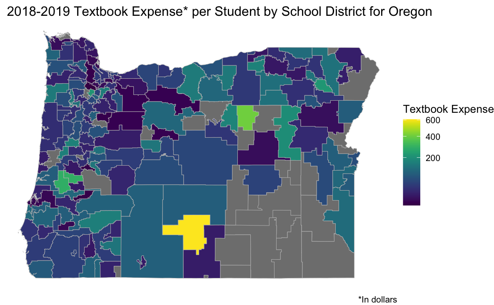

```{r setup, include=FALSE}
pacman::p_load("tidyverse","rio","here","janitor", "usmap","maps", "colorspace","geofacet","leaidr", "viridis","ggthemes", "arrow", "forcats", "ggrepel","edld652", "mapproj","albersusa" , "cowplot", "biscale", "plotly", "ggeasy", "flexdashboard", "Hmisc", "psych", "dplyr", "stringr", "readr", "tidyr", "corrplot", "scales", "RColorBrewer", "ggmap", "devtools", "piggyback", "maptools", "gitcreds", "knitr", "kableExtra", "xtable", "PerformanceAnalytics", "corrgram", "GGally", "gghighlight", "ggtext", "viridis")
```


```{r}
sm <- import(here("data","state_membership.rda"))

#Grade only K-12
#Student count by race_ethnicity in K-12 


sm <- subset(sm, grepl(("^G|^K"), grade))
sm <- sm %>% 
    filter(grade != "Grade 13") %>%
    filter(!race_ethnicity %in% c("Not Specified", "No Category Codes")) %>% 
    group_by(st, race_ethnicity, year) %>% 
    summarise(
        student = sum(student_count, na.rm = TRUE) #students belonging to one race 
    ) 

#Note to self: Missing total student data for AS(2017), DA(2017), and IL (2021)


#Percent of student in a certain race/ethnicity for each year

sm_p <- sm %>% 
    group_by(st, race_ethnicity, year) %>% 
    summarise(
        stu_total = sum(student)
    ) %>% 
    group_by(st, year) %>% 
    mutate(
        total = sum(stu_total),
        percent_s = round((stu_total*100/total),3)
    )   %>% 
    select(st, year, race_ethnicity, percent_s) %>% 
    pivot_wider(
        names_from = year,
        names_prefix = "y_",
        values_from = percent_s
    )


#Wide data frame for change
sm_wide <- sm %>% 
    pivot_wider(
        names_from = year,
        names_prefix = "year_",
        values_from = student
    ) %>% 
    mutate(
        change_1820 = year_2020 - year_2018,
        change_1821 = year_2021 - year_2018,
        change_2021 = year_2021 - year_2020,
        change_1720 = year_2017 - year_2020,
        pchange_1820 = ifelse(year_2018 == 0, NA, (year_2020 - year_2018)/year_2018),
        pchange_1821 = ifelse(year_2018 == 0, NA, (year_2021 - year_2018)/year_2018),
        pchange_1720 = ifelse(year_2017 == 0, NA, (year_2020 - year_2017)/year_2017),
        pchange_2021 = ifelse(year_2020 == 0, NA, (year_2021 - year_2020)/year_2020)
    )%>%
        mutate(
            race_ethnicity = ifelse(race_ethnicity == "Native Hawaiian or Other Pacific Islander", "Native Hawaiian or \nOther Pacific Islander", race_ethnicity)
        )

#us <- usa_sf()
#us <- rename(us, st = iso_3166_2)
#sf::write_sf(us,here("data","us_states.shp"))
us <- sf::read_sf(here("data","us_states.shp"))

sm_18 <- sm %>%
    filter(year == "2018") %>% 
    group_by(st, race_ethnicity) %>% 
    summarise(
        stu_total = sum(student)
    ) %>% 
    group_by(st) %>% 
    mutate(
        total = sum(stu_total),
        percent_s = round((stu_total*100/total),3)
    ) %>% 
    left_join(us, by = "st") 
```

# RQ 1 - A

Sidebar Title {.sidebar}
--------------

**RQ 1: Student and Teacher ethnic distribution in K-12 public schools in the US in SY 2017-18**

First, I tried to summarize state and ethnic-wise student population. For this I used the state membership data file. 

The first challenge was to which number to report - the raw number, transform data to log, change scale to log scale, or percentage of state population. At the end, I decided to go with the percentage of state population. That is, I found the total number of students in a given state, and divided student count per ethnic group with this total.

The next challenge was how to represent so much information in an effective way. My first two attempts involved using facet_wrap and facet_geo (first two tabs). I realized having a legend so far up isn't very audience friendly, and decided to go with choropleth maps. 

The last few iterations involved position of legend, relative size of different elements, an appropriate title and subtitle, as well as a colorblind friendly theme. I tried almost all available palettes on R, and went ahead with "magma" from the `viridis` package. I made a second version of the map with a discrete scale, which I thought is better for a static version (third and fourth tabs). 

The story I'm trying to tell is that the student population is more diverse than we think - the majority of our student population is students of color, and our education system should be culturally-relevant. 

-------------


Column {.tabset data-width=650}
-----------------------------------------

### First Iteration


```{r }
facet <- ggplot(data = sm_18) +
    geom_col(aes(x = race_ethnicity,
                 y = percent_s))+
    facet_wrap(~st)+
   # scale_fill_brewer(palette = "Dark2")+
    coord_flip()+
    labs(
        title = "Student population by ethnicity",
        x = "Percent of students",
        y = ""
    )+
    theme_minimal(base_size = 5)+
    scale_y_continuous(expand = c(0,0))
    # theme(
    #     axis.text.y = element_blank(),
    #     axis.ticks = element_blank(),
    #     legend.position = "top" 
    # )


facet
```

### Second Iteration

```{r}
geofacet <- ggplot(data = sm_18) +
    geom_col(aes(x = race_ethnicity,
                 y = percent_s,
                 fill = race_ethnicity))+
    facet_geo(~st, grid = "us_state_grid1")+
    scale_fill_brewer(palette = "Dark2")+
    coord_flip()+
    labs(
        title = "Student population by ethnicity",
        x = "Percent of students",
        y = ""
    )+
    theme_minimal(base_size = 8)+
    # guides(shape = guide_legend(override.aes = list(size = 5)),
    #            color = guide_legend(override.aes = list(size = 0.1))) +
        theme(legend.title = element_text(size = 6), 
              legend.text  = element_text(size = 6),
              legend.key.size = unit(0.5, "lines"),
              axis.text.y = element_blank(),
            axis.ticks = element_blank(),
            legend.position = "top" )+
    scale_y_continuous(expand = c(0,0))

geofacet
```

### Final Iteration 1

```{r}
maptheme1 <- function() {
    ggthemes::theme_map(base_size=8) +
    theme(
        strip.background = element_blank(),
        legend.position = c(.77, .1),
        legend.direction = "horizontal",
        legend.title = element_text(size = 6), 
        legend.text  = element_text(size = 6),
        legend.key.size = unit(1, "lines"),
        plot.title.position = "plot",
        text=element_text(family= "sans"),
        plot.title = element_text(face="bold"),
        plot.subtitle = element_text(face="italic"),
        plot.caption = element_text(color ="gray30",hjust = 0),
        axis.title = element_text(face = "bold")
    )
}

maptheme2 <- function() {
    ggthemes::theme_map(base_size=8) +
    theme(
        strip.background = element_blank(),
        legend.position = "bottom",
        legend.title = element_text(size = 6), 
        legend.text  = element_text(size = 6),
        legend.key.size = unit(1, "lines"),
        plot.title.position = "plot",
        text=element_text(family= "sans"),
        plot.title = element_text(face="bold"),
        plot.subtitle = element_text(face="italic"),
        plot.caption = element_text(color ="gray30",hjust = 0),
        axis.title = element_text(face = "bold")
    )
}


map <- sm_18 %>%  
        filter(!st %in% c("BI","AS","GU","PR","VI")) %>%
        mutate(
            race_ethnicity = ifelse(race_ethnicity == "Native Hawaiian or Other Pacific Islander", "Native Hawaiian or \nOther Pacific Islander", race_ethnicity)
        ) %>% 
        ggplot(aes(geometry = geometry, fill = percent_s)) +
    	geom_sf(color = "gray70", size = 0.2) +
    	#guides(color = "none") +
        scale_fill_viridis_c(option = "magma",
                             name = "Percent of Students",
                             direction = -1,
                             limits = c(1,100)) +
        #theme_map(base_size = 16) +
        labs(
            title = "Student Diversity in K-12 Public Schools (2017-18)",
            subtitle = "52% of all students identify as non-White",
            caption = " \n \nGray represents proportion of less than 1%\nSource: U.S. Department of Education, National Center for Education Statistics, Common Core of Data (CCD)"
        )+
        facet_wrap(~ race_ethnicity, nrow = 2) +
        # theme(strip.background = element_blank(),
        #       legend.position = c(.77, .1),
        #       legend.direction = "horizontal"
        #       )+
        guides(fill = guide_colourbar(title.position="top", barwidth = 5))+
        maptheme1()

map
```

### Final Iteration 2

```{r}
map2 <- sm_18 %>%  
        filter(!st %in% c("BI","AS","GU","PR","VI")) %>% 
        mutate(
        race_ethnicity = ifelse(race_ethnicity == "Native Hawaiian or Other Pacific Islander", "Native Hawaiian or \nOther Pacific Islander", race_ethnicity)
        ) %>% 
        mutate(bins = cut(percent_s, breaks = c(0,2,10,25,50,75, 91))) %>% 
        ggplot(aes(geometry = geometry, fill = bins)) +
    	geom_sf(color = "gray70", size = 0.2) +
    	#guides(color = "none") +
        scale_fill_viridis_d(option = "A",
                             direction = -1,
                             name = "Percent of Students") +
        #theme_map(base_size = 16) +
        labs(
            title = "Student Diversity in K-12 Public Schools (2017-18)",
            subtitle = "52% of all students identify as non-White",
            caption = " \n \nSource: U.S. Department of Education, National Center for Education Statistics, Common Core of Data (CCD)"
        )+
        guides(fill = guide_legend(nrow = 1))+
        facet_wrap(~ race_ethnicity, nrow = 2) +
        # theme(legend.position = "bottom",
        #       #legend.direction = "horizontal",
        #       strip.background = element_blank())
        maptheme2()

map2

```

#  RQ1 - B

Sidebar Title {.sidebar}
--------------

**RQ 1: Student and Teacher ethnic distribution in K-12 public schools in the US in SY 2017-18**

Once I had the student population by race/ethnicity, I created a similar visual for the teacher population. For this I used the publicly available summarized [table](https://nces.ed.gov/surveys/ntps/tables/ntps1718_fltable01_t1s.asp) from NCES. 

Next, I wanted to compare the teacher of color and student of color side-by-side. I collapsed all the race and ethnicity that were non-White to get this number. I approached it from two ways. First, two side-by-side map for teacher and student of color. This looked fine, but didn't help make comparison easily. Next, I displayed the same information on a dot-plot. I felt this helped make the difference in the two population come out more effectively.

In the final iterations, I revised the message, removed gridlines, added text, changed position of legends to make it more audience-friendly.

The story here is that the student population is much more diverse than the teacher population, and this disparity can have huge consequences on the student outcomes. 


Column {.tabset data-width=650}
-----------------------------------------

### Teacher population by race and ethnicity

```{r}
teacher <- import(here("data","ntps1718_fltable01_t1s.xlsx"), skip = 2, n_max = 62) %>% 
    clean_names() %>% 
    select(-c(3,5,7,9,11,13,15)) %>% 
    filter(!is.na(state))
teacher[teacher == "#"] <- 0 #code-book says # means rounds to 0
teacher[teacher == "‡"] <- NA #code-book says this symbol means there were inconsistencies in the data

teacher <- teacher %>% 
    select(
        "White" = white_non_hispanic,
        "Black or African American" = black_or_african_american_non_hispanic,
        "American Indian or Alaska Native" = american_indian_alaska_native_non_hispanic,
        "Asian" = asian_non_hispanic,
        "Hispanic/Latino" = hispanic_regardless_of_race1,
        "Native Hawaiian or Other Pacific Islander" = native_hawaiian_pacific_islander_non_hispanic,
        "Two or more races" = two_or_more_races_non_hispanic,
        everything()
    ) 

stu_teacher <- teacher %>% 
    pivot_longer(
        cols = c(1:7),
        names_to = "race",
        values_to = "percent_t"
    ) %>%  
    mutate(percent_t = readr::parse_number(percent_t)) %>%  
    left_join(us %>% select(name, st), by = c("state" = "name")) %>% 
    left_join(sm_p %>% select(st, race_ethnicity, "percent_s" = y_2018), by = c("st", "race" = "race_ethnicity")) %>% 
    pivot_longer(
        cols = c("percent_t", "percent_s"),
        names_to = "profession",
        names_prefix = "percent_",
        values_to = "percent"
    )

teacher_long <- teacher %>% 
    pivot_longer(
        cols = c(1:7),
        names_to = "race",
        values_to = "percent_t"
    ) %>%  
    mutate(percent_t = readr::parse_number(percent_t)) %>% 
    right_join(us, by = c("state" = "name"))

```

```{r}

map_t <- teacher_long%>% 
    mutate(
        race = ifelse(race == "Native Hawaiian or Other Pacific Islander", "Native Hawaiian or \nOther Pacific Islander", race)
    ) %>% 
    ggplot(aes(geometry = geometry, fill = percent_t)) +
	geom_sf(color = "gray70", size = 0.2) +
	#guides(color = "none") +
    scale_fill_viridis_c(option = "magma",
                             name = "Percent of Teachers",
                             direction = -1,
                             limits = c(0.5,100)) +
    #theme_map(base_size = 16) + 
    labs(
            title = "Teacher Diversity in K-12 Public Schools (2017-18)",
            subtitle = "21% of all teachers identify as non-White",
            caption = " \n \nNo teacher data for Maryland and Washington DC.\nGray represents a proportion less than 0.5%. \nSource: U.S. Department of Education, National Center for Education Statistics, National Teacher and Principal Survey (NTPS)"
        )+
    facet_wrap(~ race, nrow = 2) +
    guides(fill = guide_colourbar(title.position="top", barwidth = 5))+
    # theme(legend.position = "bottom",
    #       strip.background = element_blank()) +
        maptheme1()

map_t
```


### Student and Teacher of Color

```{r}
st_binary <- stu_teacher %>% 
    mutate(
        rbinary = ifelse(race == "White", "White","People of Color")
    ) %>%
    # filter(state == "Hawaii") %>% 
    # group_by(profession) %>% 
    # summarise(
    #     percent_total = sum(percent, na.rm = TRUE)
    # )
    group_by(state, rbinary, profession) %>% 
    summarise(
        percent_total = sum(percent, na.rm = TRUE)
    ) %>% 
    filter(rbinary != "White" & state != "United States") %>%
    mutate(
        profession = ifelse(profession == "s", "Student", "Teacher")
    ) %>% 
    right_join(us, by = c("state" = "name"))


map3 <- ggplot(st_binary, aes(geometry = geometry, fill = percent_total)) +
	geom_sf(color = "gray70", size = 0.2) +
	#guides(color = "none") +
    scale_fill_viridis_c(option = "magma",
                             name = "Percent of population",
                             direction = -1,
                             limits = c(1,100)) +
    #theme_map(base_size = 16) + 
    labs(
            title = "Student Teacher Diveristy Gap (SY 2017-18)",
            subtitle = "52% of all students identify as non-White while only 21% of all teachers identify as non-White",
            caption = " \n \nGray represents proportion of less than 1%. \nNo teacher data for Maryland and Washington DC.\nSource: U.S. Department of Education, National Center for Education Statistics, CCD and NTPS." 
        )+
    facet_wrap(~ profession, nrow = 1) +
    guides(fill = guide_colourbar(title.position="top", barwidth = 5))+
    # theme(legend.position = "bottom",
    #       strip.background = element_blank()) +
        maptheme2()

map3
```

### Student and Teacher of Color

```{r}
dotplot <- st_binary %>%
    filter(!state %in% c("Maryland", "District of Columbia")) %>% 
    ggplot(aes(x = percent_total, y = forcats::fct_reorder(state, percent_total))) +
    geom_line(aes(group = state), linetype = "dotted", color = "gray80")+
    geom_point(aes(color = profession), size = 1.5)+
    # geom_text(data = filter(st_binary2, profession == "Student"),
    #                         aes(x=percent_total, y=state, label = round(percent_total,0)),
    #            nudge_x = 1, size = 4, family = "sans", color = "#1B9E77")+

    #geom_text(label = percent_total)+
    # annotate(geom = "text",
    #          x = c(75,88),
    #          y = c(50,50),
    #          label = c("Teacher", "Student"),
    #          size = 3)+
    geom_text(aes(x=percent_total, y=state, label = round(percent_total,0)),
               nudge_x = 1.5, size = 2, family = "sans")+
    scale_color_brewer(palette = "Dark2", name = "")+
    scale_x_continuous(expand = c(0,0), limits = c(0,95))+
    theme_minimal(base_size = 8)+
    labs(
        x = "Percent",
        y  = "States",
        title = "Student Teacher Diveristy Gap (SY 2017-18)",
        subtitle = "52% of all students identify as non-White while only 21% of all teachers identify as non-White",
        caption = " \n \nNo teacher data for Maryland and Washington DC.\nSource: U.S. Department of Education, National Center for Education Statistics, CCD and NTPS."
        )+
    theme(
        panel.grid.minor = element_blank(),
        panel.grid.major = element_blank(),
        axis.text.x = element_blank(),
        axis.line.x = element_line(colour = "gray90"),
        legend.key = element_rect(fill = "white", colour = "gray90"),
        #legend.box.background = element_rect(color="black"),
        legend.position = c(.85, .75),
     #   legend.direction = "horizontal",
        plot.title.position = "plot",
        text=element_text(family= "sans"),
        plot.title = element_text(face="bold"),
        plot.subtitle = element_text(face="italic"),
        plot.caption = element_text(color ="gray30",hjust = 0),
        axis.title = element_text(face = "bold")
    )


dotplot
```
 
# RQ1 - C

Sidebar Title {.sidebar}
--------------

This is more exploratory, and wasn't a part of our original question.I became curious if the student population has been changing over time, and what happened during COVID? Though I haven't interpreted these results at length, it seems that the White student population decreased, and the Two or More races and Hispanic population increased over time (SY 2017-18 to SY 2019-2020). The rate was slower during COVID.

For this, I sticked with my map theme, and used a diverging palette. In one case where I changed it to a discrete scale, I defined my own palette because I didn't want white as the center point. 

The story here is that we can expect the student population to keep diversifying. The question for the public and policy makers is what are we doing to address these diverse needs, and whether conscious effort is being made to diversify the workforce. 

Column {.tabset data-width=650}
-----------------------------------------

### Change from 2018-2020 - Iteration 1 

```{r}
sm_change <- sm_wide %>% 
        select(st, race_ethnicity, pchange_1820, pchange_2021) %>% 
        filter(!st %in% c("BI","AS","GU","PR","VI", "DA")) %>% 
        pivot_longer(
            cols = starts_with("pchange_"),
            names_to = "pchange",
            values_to = "stu_count"
        ) %>% 
        mutate(
            stu_count = 100*stu_count
        ) %>% 
        filter(
            stu_count != -100
        ) %>% 
        mutate(bins = cut(stu_count, breaks = c(-Inf,-40,-15,-5, 0, 5,15,40,107))) %>%
        left_join(us, by = "st")

map_c1 <- sm_change %>% 
    filter(pchange == "pchange_1820") %>% 
    ggplot(aes(geometry = geometry, fill = stu_count)) +
    	geom_sf(color = "gray70", size = 0.2) +
    	#guides(color = "none") +
        scale_fill_continuous_diverging(palette = "Blue-Red3",
                                         rev = TRUE,
                                         name = "%Change in Students",
                                         na.value = "gray90",
                                        limits = c(-40,40) ) +
        #theme_map(base_size = 16) + 
        labs(
            title = "Percentage Change in Student Population from Fall 2017 to Fall 2019",
            caption = " \n \nSource: U.S. Department of Education, National Center for Education Statistics, Common Core of Data (CCD)"
            )+
        facet_wrap(~ race_ethnicity, nrow = 2) +
        guides(fill = guide_colourbar(title.position="top", barwidth = 5))+
        # theme(legend.position = "bottom",
        #       strip.background = element_blank())+
        maptheme1()

map_c1
```


### Change from 2018-2020 - Iteration 2

```{r}

palette <- rev(diverging_hcl(palette = "Blue-Red3", n = 8)[1:7])

map_c2 <- sm_change %>% 
    filter(pchange == "pchange_1820") %>%
    filter(!is.na(bins)) %>% 
     ggplot(aes(geometry = geometry, fill = bins)) +
    	geom_sf(color = "gray30", size = 0.2) +
    #	guides(color = "none") +
        scale_fill_manual(values = palette, name ="%Change in Students")+
     #   theme_map(base_size = 16) + 
    labs(
            title = "Percentage Change in Student Population from Fall 2017 to Fall 2019",
            caption = " \n \nSource: U.S. Department of Education, National Center for Education Statistics, Common Core of Data (CCD)"
            )+
    guides(fill = guide_legend(nrow = 1))+
    facet_wrap(~ race_ethnicity, nrow = 2) +
        # theme(legend.position = "bottom",
        #       strip.background = element_blank())+
    maptheme2()


map_c2

```

### Change during Covid - Iteration 1

```{r}
map_c3 <- sm_change %>% 
    filter(pchange == "pchange_2021") %>% 
    ggplot(aes(geometry = geometry, fill = stu_count)) +
    	geom_sf(color = "gray70", size = 0.2) +
    	#guides(color = "none") +
        scale_fill_continuous_diverging(palette = "Blue-Red3",
                                         rev = TRUE,
                                         name = "%Change in Students",
                                         na.value = "gray90",
                                        limits = c(-40,40) ) +
        facet_wrap(~ race_ethnicity, nrow = 2) +
        #theme_map(base_size = 16)+
    labs(
            title = "Percentage Change in Student Population from Fall 2019 to Fall 2020",
            caption = " \nNo Fall 2020 data for Illinois\nSource: U.S. Department of Education, National Center for Education Statistics, Common Core of Data (CCD)"
            )+
    guides(fill = guide_colourbar(title.position="top", barwidth = 5))+
        # theme(legend.position = "bottom",
        #       strip.background = element_blank())+
    maptheme1()

map_c3
```


### Change during Covid - Iteration 2

```{r}
map_c4 <- sm_change %>% 
    filter(pchange == "pchange_2021") %>% 
     ggplot(aes(geometry = geometry, fill = bins)) +
    	geom_sf(color = "gray30", size = 0.2) +
    #	guides(color = "none") +
        scale_fill_discrete_diverging(palette = "Blue-Red3",
                                         rev = TRUE,
                                         name = "%Change in Students",
                                         na.value = "gray90") +
        facet_wrap(~ race_ethnicity, nrow = 2) +
     #   theme_map(base_size = 14)+
    labs(
            title = "Percentage Change in Student Population from Fall 2019 to Fall 2020",
            caption = " \nNo Fall 2020 data for Illinois\nSource: U.S. Department of Education, National Center for Education Statistics, Common Core of Data (CCD)"
            )+
    guides(fill = guide_legend(nrow = 1))+
        # theme(legend.position = "bottom",
        #       strip.background = element_blank())+
        maptheme2()

map_c4

```


# RQ2 RLA

Column 1 {data-width=100}
-----------------------------------------------------------------------
**Research Question**

How does the the proficiency level in Reading and Language skill vary across state for High School Students? How does it differ by students characteristics such as English Learner status, Student with Disability, Low Income students?


**Data Source:**
State Assessments in Reading/Language Arts and Mathematics- School Year 2018-19 EDFacts Data Documentation, U.S. Department of Education, Washington, DC: EDFacts. Retrieved February 2, 2022 from http://www.ed.gov/edfacts


-----------------------------------------------------------------------


```{r include=FALSE}
#rla_sc <- import(here("Data", "rla_sc.csv"))  #uncomment this read from your local.
r2a <- import(here("Data","r2a.csv"))
#math_sc <- import(here("Data", "math_sc.csv"))
state_r2b <- import(here("Data", "state_r2b.csv"))
dist_r2b <- import(here("Data", "dist_r2b.csv"))
```

```{r include=FALSE}
us <- usa_sf()
#us$name <- stringr::str_to_upper(us$name)
join <- left_join(r2a, us, by = c("stnam"= "name"))

a <- ggplot(join) +
  geom_sf(aes(geometry = geometry, fill = allrla))+
  scale_fill_continuous_divergingx(palette = "Earth",  labels = scales::comma)+
  theme_minimal() +
  labs(title = "All Students") +
  theme(
    legend.position="none",
        axis.text.x = element_blank(),
        axis.ticks = element_blank(),
        axis.text.y = element_blank(),
        rect = element_blank(),
        panel.grid.major = element_blank())

b <- ggplot(join) +
  geom_sf(aes(geometry = geometry, fill = cwdrla))+
  scale_fill_continuous_divergingx(palette = "Earth",  labels = scales::comma)+
  theme_minimal() +
  labs(title = "Students with Disability") +
  theme(
    legend.position="none",
        axis.text.x = element_blank(),
        axis.ticks = element_blank(),
        axis.text.y = element_blank(),
        rect = element_blank(),
        panel.grid.major = element_blank())


c <- ggplot(join) +
  geom_sf(aes(geometry = geometry, fill = ecdrla))+
  scale_fill_continuous_divergingx(palette = "Earth",  labels = scales::comma)+
  theme_minimal() +
   labs(title = "Low-income students",
        fill = "% at and above \nprofeciency level") +
  theme(
    legend.position="none",
        axis.text.x = element_blank(),
        axis.ticks = element_blank(),
        axis.text.y = element_blank(),
        rect = element_blank(),
        panel.grid.major = element_blank())

d <- ggplot(join) +
  geom_sf(aes(geometry = geometry, fill = leprla))+
  scale_fill_continuous_divergingx(palette = "Earth",  labels = scales::comma) +
  theme_minimal() +
   labs(title = "EL Students",
        fill = "% student") +
  theme(legend.position="none",
        axis.text.x = element_blank(),
        axis.ticks = element_blank(),
        axis.text.y = element_blank(),
        rect = element_blank(),
        panel.grid.major = element_blank(),
        legend.direction = "horizontal",
        legend.key.size = unit(1, 'cm'),
        legend.key.height = unit(.5,"cm"))

p <- plot_grid(a, b, c, d)
legend <- get_legend(d +
    guides(color = guide_legend(nrow = 1)) +
    theme(legend.position = "bottom"))
title <- ggdraw() + draw_label("Average percent of students at & above RLA proficiency", fontface='bold')

plot <-plot_grid(title, p, legend,ncol=1,rel_heights = c(0.1,1))

```


Column {data-width=500}
-----------------------------------------------------------------------
### Percent of students at and above Reading and Languange Proficiency Level based on characteristics across the States

```{r}

plot
```

> I decided to use map graph to visualize the achievement gap of students with disability, EL students, and Low-income students compared to their peers. This way, audience can compare each state math achievement across all categories as well as able to perceive the intensity of gap with heatmap color for easier interpretation. 

Column {.tabset data-width=400}
-----------------------------------------------------------------------


### A. Children with disability

```{r}
#proficiency level for children with disability
cwdp <- r2a %>%
  ggplot()+
  geom_bar(aes(allrla, fct_reorder(stnam, allrla)), stat = "identity", fill = "gray80")+
  geom_col(aes(cwdrla, stnam), fill = "#A1D2F1")+
  scale_x_continuous(expand = c(0,0),
                     limits = c(0,101))+
    labs(title = "Students with Disabililty vs All Students",
         y = "",
       x= "Percent of students at and above RLA proficiency") +
      theme_minimal() +
   theme(plot.title.position = "plot",  #left aligned title and subtitle
    plot.title = element_text(family = 'Helvetica',
                               color = '#666666',
                               face = 'bold',
                               size = 12
                              ))

ggplotly(cwdp)
```

> The goal of these bar plots is to show achievement gap of students with disability, EL students, and Low-income students compared to their peers. In the previos set of plots, the bar was presented on its own. I decided to add the all students average in grey as the background for easier comparison. However, I want people to be able to compare the difference all at once in one frame. 

### B. English language learner

```{r}
#proficiency level for english language learner
 lepp <- r2a %>%
  ggplot() +
  geom_bar(aes(allrla, fct_reorder(stnam, allrla)), stat = "identity", fill = "gray80")+
  geom_col(aes(leprla, stnam), fill = "#EEC77E")+
  scale_x_continuous(expand = c(0,0),
                     limits = c(0,101))+
  labs(
       title = "English Language Learners vs All Students",
         y = "",
       x= "Percent of students at and above RLA proficiency") +
    theme_minimal() +
   theme(plot.title.position = "plot",  #left aligned title and subtitle
    plot.title = element_text(family = 'Helvetica',
                               color = '#666666',
                               face = 'bold',
                               size = 12
                              ))
ggplotly(lepp)
```

### C. Economically disadvantaged students

```{r}

#proficiency level for Economically disadvantaged students
ecdp <- r2a %>%
  ggplot()+
  geom_bar(aes(allrla, fct_reorder(stnam, allrla)), stat = "identity", fill = "gray80")+
 geom_col(aes(ecdrla, stnam), fill = "#F1A8A1")+
  scale_x_continuous(expand = c(0,0),
                     limits = c(0,101)) +
  labs(title = "Low-Income Students vs All Students",
         y = "",
       x= "Percent of students at and above RLA proficiency") +
  theme_minimal() +
   theme(plot.title.position = "plot",  #left aligned title and subtitle
    plot.title = element_text(family = 'Helvetica',
                               color = '#666666',
                               face = 'bold',
                               size = 12,
                              ))
ggplotly(ecdp)
```


### D. All Students
```{r}
allp <- r2a %>%
  ggplot() +
   geom_bar(aes(allrla, fct_reorder(stnam, allrla)), stat = "identity", fill = "gray80")+
    scale_x_continuous(expand = c(0,0),
                        limits = c(0,101) ) +
   labs(title = "All High School Students Category",
         y = "",
       x= "Percent of students at and above RLA proficiency") +
    theme_minimal() +
   theme(plot.title.position = "plot",  #left aligned title and subtitle
    plot.title = element_text(family = 'Helvetica',
                               color = '#666666',
                               face = 'bold',
                               size = 12
                              ))
ggplotly(allp)
```
# RQ2 Math

Column 1 {data-width=100}
-----------------------------------------------------------------------
**Research Question**

How does the the proficiency level in  math vary across state for High School Students? Also, how does it vary across the US regions (i.e Midwest, Northeast, South, and West)?


**Data Source:**
State Assessments in Reading/Language Arts and Mathematics- School Year 2018-19 EDFacts Data Documentation, U.S. Department of Education, Washington, DC: EDFacts. Retrieved February 2, 2022 from http://www.ed.gov/edfacts


-----------------------------------------------------------------------


```{r include=FALSE}
#### Diverging Plots Math
state_r2 <- state_r2b %>%
  drop_na(allmath)

state_r2$math_z <- round(state_r2$allmath - mean(state_r2$allmath),2)
state_r2$math_type <-ifelse(state_r2$math_z < 0, "below", "above")
```

Column {data-width=450}
-----------------------------------------------------------------------


### Math Proficiency by Regions


```{r}
region <- import(here("data", "us census bureau regions and divisions.csv")) %>%
  rename(stnam = State)
heatmap <- left_join(state_r2b, region)

e <- heatmap %>%
    group_by(stnam, Region) %>%
  drop_na(allmath) %>%
  drop_na(Region) %>%
    ggplot() +
    geom_col(aes(allmath, fct_reorder(stnam, allmath), fill = Region)) +
      labs(x= "Percent of student at and above Proficiency level in Math",
       y = "",
       title = "Math Proficiency by Region") +
    theme_light()+
    scale_x_continuous(expand = c(0,0), labels = scales::comma ) +
  theme (axis.ticks = element_blank()) +
    scico::scale_fill_scico_d()
ggplotly(e)
```
> The south region has relatively high percentage of students at and above Math proficiency, in contrast, the West region has relatively low percentage of students at and above Math proficiency. There is no clear pattern for Midwest and Northeast regions as there is large variation of Math profiency within these regions.


Column {.tabset data-width=450}
-----------------------------------------------------------------------

### Diverging Bars for Math Scores


```{r}
#Diverging plot with geom_bar
ppmath <- state_r2 %>%
  mutate(stnam = fct_reorder(stnam, math_z)) %>%
  ggplot(aes(math_z, stnam)) +
  geom_bar(stat = "identity", aes(fill =math_type), width=0.5)+
  scale_fill_manual(name = "Average Math",
                    values = c("above" = "#00ba38", "below"="#f8766d")) +
  labs(title= "Diverging Bars",
        x = "Mean-centered percent student at and above the Math proficiency",
       y = "") +
    theme_minimal() +
   theme(legend.position="none")

ggplotly(ppmath)

```
> Another way to display the variation of Math proficiency skill across states is by showing how far the state mean diverge above and below the national mean. I like the simplicity of this map instead of the previous one and chose red color to represent below the average and green color to represent above the average. I think this map is easier to understand for general audience. 

### Diverging Lollipop Chart - Math

```{r}
pmath <- state_r2 %>%
  mutate(stnam = fct_reorder(stnam, math_z)) %>%
  ggplot(aes(math_z, stnam)) +
  geom_point(stat = "identity", color ="#D7987F", size=2.5)+
  geom_segment(aes(y= stnam,
                   x = 0,
                   yend= stnam,
                   xend=math_z), color = "#D7987F", size = .5) +
  geom_text(aes(label = math_z), color = "black", size = 1.5) +
  labs(title= "Diverging Lollipop Chart",
       x ="Mean-centered percent student at and above the Math proficiency",
       y = "") +
  theme_minimal() +
  theme(axis.text.y = element_text(size=8))
ggplotly(pmath)
```
> This is the initial diverging plot that includes anotated state mean difference relative to national average. However, the number is too small and the information has already displayed through the geom_segment() line. I decided to use the other diverging bar plot. 


# RQ2 Textbook Spending

Column 1 {data-width=100}
-----------------------------------------------------------------------
**Research Question**

How does the the proficiency level in Reading and Language skill vary across state for High School Students? How does it differ by students characteristics such as English Learner status, Student with Disability, Low Income students?


**Data Source:**
Distric Fiscal documentation 2018
[School year 2019](https://nces.ed.gov/ccd/Data/txt/sdf19_1a_layout.docx) Retrieved February 2, 2022.


> On Average, Indiana spent the most on textbook per student at $107, while Hawaii spent the least on textbook per student at $14.

-----------------------------------------------------------------------

```{r include=FALSE}
textbook_us <- left_join( us, state_r2b, by = c("name" = "stnam")) %>%
  mutate(Textbook = round(stperstudbook,2)) %>%
ggplot() +
  geom_sf(aes(geometry = geometry, fill = Textbook)) +
  scale_fill_continuous_divergingx(palette = "Earth",  labels = scales::dollar) +
  theme_minimal() +
  labs(fill = "Textbook Spending \nper Student",
       title = "Average Textbook Spending Per Student Across the States") +
  theme(legend.position="bottom",
        axis.text.x = element_blank(),
        axis.ticks = element_blank(),
        axis.text.y = element_blank(),
         legend.key.height = unit(0.1,"cm"),
        rect = element_blank(),
        panel.grid.major = element_blank())


```

Column {data-width=600}
-----------------------------------------------------------------------

### Textbook spending across the US


```{r}

ggplotly(textbook_us)
```
> The average spending per students in district level is aggregated at the state level. Since we will calculate the textbook spending and student achievement only in state level, I decided to have to state-level map as the final version.  


Column {.tabset data-width=300}
-----------------------------------------------------------------------


### Indiana

```{r include=FALSE}
book_ind <- dist_r2b %>%
  filter(stnam == "Indiana") %>%
  mutate(perstudbook = round(perstudbook,2))


ind <- lea_get(state = "in") %>%
    sf::st_as_sf() %>%
  rename(leaid = GEOID) %>%
  mutate(leaid = as.integer(leaid))


ind_book <- left_join(ind, book_ind) %>%
  rename( `textbook($)` = perstudbook) %>%
  ggplot() +
  geom_sf(aes(fill = `textbook($)`), size = 0.1) +
  scale_fill_continuous_divergingx(palette = "Earth",  labels = scales::dollar) +
  theme_minimal()+
  theme(legend.key.height= unit(0.5, 'cm'),
        legend.key.width= unit(.5, 'cm'),
        axis.text.x=element_blank(),
        axis.text.y=element_blank(),
         panel.grid.major = element_blank()) +
  labs(fill = "Textbook funding \nper student",
       title = "Textbook spending per student for school districts in Indiana")
```


```{r}
ggplotly(ind_book)
```

> Initially, we wanted to present overall district spending per student in one large US map. However, we had two problems with the plan. 1. The amount of time to render the plot is too long and 2. Too many information in one map and it might distract our audience from our main goal. We decided to have each state district spending and play around with ggplotly function where audience can zoom in and out easily. 


### Virginia


```{r include=FALSE}
book_va <- dist_r2b %>%
  filter(stnam == "Virginia") %>%
  mutate(perstudbook = round(perstudbook,2))


va <- lea_get(state = "va") %>%
    sf::st_as_sf() %>%
  rename(leaid = GEOID) %>%
  mutate(leaid = as.integer(leaid))


va_book <- left_join(va, book_va) %>%
  rename( `textbook($)` = perstudbook) %>%
  ggplot() +
  geom_sf(aes(fill = `textbook($)`), size = 0.1) +
  scale_fill_continuous_divergingx(palette = "Earth",  labels = scales::dollar) +
  theme_minimal()+
  theme(legend.key.height= unit(0.5, 'cm'),
        legend.key.width= unit(.5, 'cm'),
        axis.text.x=element_blank(),
        axis.text.y=element_blank(),
        panel.grid.major = element_blank()) +
  labs(fill = "Textbook funding \nper student",
       title = "Textbook spending per student for school districts in Virginia")
```

```{r}
va_book
```

### West Virginia

```{r include=FALSE}
textbook_wv <- dist_r2b %>%
  filter(stnam == "West Virginia") %>%
  mutate(perstudbook = round(perstudbook,2))


wv <- lea_get(state = "wv") %>%
    sf::st_as_sf() %>%
  rename(leaid = GEOID) %>%
  mutate(leaid = as.integer(leaid))

wv_book <- left_join(wv, textbook_wv) %>%
  rename( `textbook($)` = perstudbook) %>%
  ggplot() +
  geom_sf(aes(fill = `textbook($)`), size = 0.1) +
  theme_minimal()+
  scale_fill_continuous_divergingx(palette = "Earth",  labels = scales::dollar) +
  theme_minimal()+
  theme(legend.key.height= unit(0.5,'cm'),
        legend.key.width= unit(.5,'cm'),
        axis.text.x=element_blank(),
        axis.text.y=element_blank(),
         panel.grid.major = element_blank()) +
  labs(title= "Textbook spending per student for school districts in West Virginia",
         fill = "Textbook funding \nper student")
```


```{r}
ggplotly(wv_book)
```


### Oregon

```{r include=FALSE}
textbook_or <- dist_r2b %>%
  filter(stnam == "Oregon") %>%
  mutate(perstudbook = round(perstudbook,2))


or <- lea_get(state = "or") %>%
    sf::st_as_sf() %>%
  rename(leaid = GEOID) %>%
  mutate(leaid = as.integer(leaid))

or_book <- left_join(or, textbook_or) %>%
  rename( `textbook($)` = perstudbook) %>%
  ggplot() +
  geom_sf(aes(fill = `textbook($)`), size = 0.1) +
  theme_minimal()+
  scale_fill_continuous_divergingx(palette = "Earth",  labels = scales::dollar) +
  theme_minimal()+
  theme(legend.key.height= unit(0.5, 'cm'),
        legend.key.width= unit(.5, 'cm'),
        axis.text.x=element_blank(),
        axis.text.y=element_blank(),
         panel.grid.major = element_blank()) +
  labs(title= "Textbook spending per student for school districts in Oregon",
         fill = "Textbook funding \nper student")
```

```{r}
or_book
```


### Oregon Colorblind Friendly Version



# RQ2 Achievement vs Spending

Column 1 {data-width=100}
-----------------------------------------------------------------------
**Research Question**

What is the relationship between District Textbook Funding per Student and Students' Math and RLA achievements?


**Data Source:**
State Assessments in Reading/Language Arts and Mathematics- School Year 2018-19 EDFacts Data Documentation, U.S. Department of Education, Washington, DC: EDFacts. Retrieved February 2, 2022 from http://www.ed.gov/edfacts


-----------------------------------------------------------------------


Column {.tabset data-width=500}
-----------------------------------------------------------------------

### Math & Textbook Spending

> States with relatively low spending on textbook have lower percentage students at and above Math proficiency level.

```{r}
state_r2b%>%
  select(stnam, stperstudbook, allmath) %>%
  drop_na() %>%
  filter(!stnam == "District Of Columbia") %>%
  ggplot(aes(stperstudbook, allmath))+
  geom_point( color = "gray", size = 4, alpha = 0.4) +
  geom_smooth(fill= "gray90",method = "lm", color = "gray")+
  geom_point(data=filter(state_r2b,
                         stnam == "Virginia" |
                           stnam== "Nebraska"|
                           stnam== "New York"),
             color = "#2596be",
             alpha = 0.8,
             size =4)+
geom_point(data=filter(state_r2b,
                       stnam == "Tennessee"|
                         stnam== "Rhode Island"|
                         stnam== "Minnesota"),
           color = "#F67575",
           alpha = 0.8,
           size =4) +
  geom_text_repel(data= subset(state_r2b,
                               stnam == "Virginia" |
                                 stnam== "Nebraska"|
                                 stnam =="New York" |
                                 stnam == "Tennessee" |
                                 stnam== "Rhode Island"|
                                 stnam== "Minnesota"),
                               aes(label =stnam)) +
  theme_minimal()+
  xlim (14,108) +
    labs(title= "Textbook Spending & Math Achievement",
      x = "Textbook spending per student",
       y = "% of Students at & above Proficiency Level",
      size = "Spending \nper Student",
      caption = "3 Top/Bottom States with Percent of Student at and above Math Proficiency \nare labeled and colored blue/red, respectively")+
    geom_richtext(x=90,y=50, label="<i>R</i> = 0.33 \n<i>p</i> = 0.045", size = 2, color = "gray30")+
  theme(legend.position = "bottom")

```

> This is my final plot where I added a linear line and annotated the correlation between Textbook spending and Math achievement. I highlighted the 3 top and bottom states based on their Math achievement and colored the rest of the states with gray and a degree of transparency. This plot is simple and highlighted the most important information.


```{r include=FALSE}
library("ggpubr")
ggscatter(state_r2b, x = "stperstudbook", y = "allmath",
          add = "reg.line", conf.int = TRUE,
          cor.coef = TRUE, cor.method = "pearson")

ggscatter(state_r2b, x = "stperstudbook", y = "allrla",
          add = "reg.line", conf.int = TRUE,
          cor.coef = TRUE, cor.method = "pearson")


```


```{r include=FALSE}
fo <- state_r2b %>%
  mutate(stnam = fct_reorder(stnam, allrla)) %>%
ggplot(aes(allrla, fct_reorder(stnam, allrla))) +
  geom_segment(aes(y = stnam, yend = stnam, x = 0, xend = allrla), color = "skyblue", size = 1) +
  geom_point(aes(size = stperstudbook), color="orange") + #, alpha= 0.7) +
  labs(title = "Textbook Spending per Student and RLA proficiency",
       #subtitle = "Arranged by Textbook spending",
       x= "Percent of students at and above proficiency level",
       y="",
       size= "Spending on textbook per student",
       color="",
       legend= "") +
  theme_minimal() +
   theme(legend.position = "bottom",
        legend.direction = "horizontal",
        legend.key.size = unit(1, 'cm'),
        legend.key.height = unit(.5,"cm"),
        legend.text=element_text(color="white",size=6),
        axis.title.x = element_text(colour = "white", size = 10),
        axis.text.y = element_text(color="white",
                           size=8),
        axis.text.x = element_text(face="bold", color="white",
                           size=10),
        plot.title = element_text(colour = "white", size = 15),
    plot.subtitle = element_text(colour = "white"),
    plot.caption = element_text(colour = "white"),
    plot.background = element_rect(fill = "#1B2547"),
    panel.background = element_rect(fill = "#1B2547"),
    panel.grid.major.y = element_blank(),
    panel.border = element_blank(),
    axis.ticks.y = element_blank(),
    plot.title.position = "plot") +
   scale_x_continuous(expand = c(0,0),
                     limits = c(0,110)) +
  guides(color = "white")
```


### RLA & Textbook Spending

```{r}
ggplotly(fo)
```

> Borrowing the existing template from another github, I tried to visualize the relationship between textbook spending and RLA achievement. I added the size function on geom_point to display amount of textbook spending. Eventhough the plot is pretty, the size of the point is a hard to discriminate. 

### RLA & Textbook Spending (Raw LM)

```{r}
state_r2b%>%
  ggplot(aes(stperstudbook,allrla))+
  geom_point(aes(size = stperstudbook), alpha = 0.3) +
  geom_smooth(method = "lm")+
  geom_text_repel(aes(label = stnam))+
  scale_x_continuous(expand = c(0,0)) +
  labs(title= "Textbook Spending & RLA Achievement",
      x = "Textbook spending per student",
       y = "Percent of Students at Proficiency Level")+
  theme(legend.position = "bottom") +
  geom_richtext(x=90,y=45, label="<i>R</i> = 0.082 \n<i>p</i> = 0.6", size = 3, color = "gray30")

```

> This is the initial plot when I tried to visualize the relationship between achievemen and textbook spending. Although all information is there, this map is too crowded with information of state name. 


Column {data-width=400}
-----------------------------------------------------------------------

### Option 1
```{r}
op1 <- state_r2b %>%
  mutate(stnam = fct_reorder(stnam, allrla)) %>%
ggplot(aes(allrla, fct_reorder(stnam, allrla))) +
  geom_point(aes(size = stperstudbook), color="blue",alpha= 0.5) +
  geom_vline(xintercept = mean(state_r2b$allrla), linetype = "dashed", color = "red") +
  labs(title = "Textbook Spending per Student and RLA proficiency",
       #subtitle = "Arranged by Textbook spending",
       x= "Percent of students at and above proficiency level",
       y="",
       size= "Spending on textbook per student",
       color="",
       legend= "") +
  theme_minimal() +
  theme(axis.text.y = element_text(size=8)) +
  annotate("text", x=64,y="Texas", label="National \nAverage", size = 3, color = "gray30")
ggplotly(op1)
```

> I like the simplicity of this plot and the national average dashed line, however, the geom_point size displaying textbook spending per student is hard to differenciate and overlapped with each other. 

### Math & Achievement gghighlight

```{r}
state_r2b%>%
  select(stnam, stperstudbook, allmath) %>%
  drop_na() %>%
  filter(!stnam == "District Of Columbia") %>%
  ggplot(aes(stperstudbook, allmath, color = stnam)) +
  geom_point( size = 4 , alpha=0.7)+
  gghighlight(allmath > 80| allmath < 40, label_key = stnam) +
  xlim (14,108) +
 # scale_x_continuous(expand = c(0,0)) +
    labs(title= "Textbook Spending & Math Achievement",
      x = "Textbook spending per student",
       y = "% of Students at & above Proficiency Level",
      size = "Spending \nper Student",
      caption = "Highlighting State Above 80% and Below 40%")+
  theme(legend.position = "bottom")
```

> This plot is clean and interesting to see because I could highlight selected state based on upper and lower criteria I specified in my code. However, I only want to use two different colors to distinguish the 3 top and lower states. A variety of color on the circle and state names are a little bit too distracting. 


# Research Question 3

```{r ethnicD, include=FALSE}
tbd_f4 <- import(here("Data", "tbd_f4.csv"))
```

Column 1 {data-width=100}
-----------------------------------------------------------------------
**Variables:**

* LEAID - ID number for each school district

* total - Total number of students in a school district

* textbk_exp_per_student - Textbook Expenditure per Student

* percentM - Percent of student population in a school district identifying as minorities

* percentW - Percent of student population in a school district identifying as white


**Data Source:** https://usafacts.org/

Column 2 {.tabset data-width=450}
-----------------------------------------------------------------------

### Correlation Coefficients Table

```{r corr, include=FALSE}
tbd_corr <- tbd_f4 %>%
  select(total, textbk_exp_per_student, percentM, percentW)

tbd_corr
```

```{r corr2, include=FALSE}
mycorr <- rcorr(as.matrix(tbd_corr))

mycorr
```

```{r corr3, include=FALSE}
corstarsl <- function(tbd_corr){
  require(Hmisc)
  x <- as.matrix(tbd_corr)
  R <- rcorr(x)$r
  p <- rcorr(x)$P

  mystars <- ifelse(p < .001, "***", ifelse(p < .01, "** ", ifelse(p < .05, "* ", " ")))

  R <- format(round(cbind(rep(-1.11, ncol(x)), R), 2))[,-1]

  Rnew <- matrix(paste(R, mystars, sep=""), ncol=ncol(x))
  diag(Rnew) <- paste(diag(R), " ", sep="")
  rownames(Rnew) <- colnames(x)
  colnames(Rnew) <- paste(colnames(x), "", sep="")

  Rnew <- as.matrix(Rnew)
  Rnew[upper.tri(Rnew, diag = TRUE)] <- ""
  Rnew <- as.data.frame(Rnew)

  Rnew <- cbind(Rnew[1:length(Rnew)])
  return(Rnew)
}

corstarsl(tbd_corr)

myXT <- xtable(corstarsl(tbd_corr[, ,2:5]))

names(myXT) <- c("Total Number of Students per District", "Textbook Expenditure per Student", "Percent of Student Population Identifying as Minority", "Percent of Student Population Identifying as White")
```

```{r}
kbl(myXT, caption = "Correlation Table for Textbook Expenditure") %>%
  kable_classic(lightable_options = "striped")

```


### Initial Scatterplot

```{r initialS}
p0 <- tbd_f4 %>%
  ggplot(aes(x = textbk_exp_per_student, y = percentM)) +
  geom_point()

p0
```

### Scatterplot for Minority Students

```{r p1, echo=FALSE, dev='jpeg'}
p1 <- tbd_f4 %>%
  ggplot(aes(x = textbk_exp_per_student, y = percentM)) +
  geom_point(aes(color = textbk_exp_per_student), size=1) +
  scale_colour_gradient(low = "light green",
                       high = "blue", name = "Cost") +
  scale_x_continuous(labels = comma) +
       labs(title = "Relationship Between Percent Minority Students and Textbook Expenditure",
       y = "Percent of Minority Students in School District",
       x= "Amount of Textbook Expenditure per Student by School District") +
  theme(panel.background = element_rect(fill = "cornsilk", colour = "yellow"))

p1
```

### Scatterplot for White Students

```{r p2, echo=FALSE, dev='jpeg'}
p2 <- tbd_f4 %>%
  ggplot(aes(x = textbk_exp_per_student, y = percentW)) +
  geom_point(aes(color = textbk_exp_per_student), size=1) +
  scale_colour_gradient(low = "light green",
                       high = "blue", name = "Cost") +
  scale_x_continuous(labels = comma) +
       labs(title = "Relationship Between Percent White Students and Textbook Expenditure",
       y = "Percent of White Students in School District",
       x= "Amount of Textbook Expenditure per Student by School District") +
  theme(panel.background = element_rect(fill = "cornsilk", colour = "yellow"))

p2
```

Column 3 {.tabset data-width=450}
-----------------------------------------------------------------------

### Lowerbound Correlation Matrix

```{r corr6}
corrplot(cor(tbd_corr),
         method = 'ellipse',
         type = 'lower',
         addCoef.col = "black",
         tl.col = "black",
         cl.ratio = 0.15, # wider spaced color legend
         tl.srt = 45, # labels at 45 degree angle
         number.cex = 0.5, # Change font size of correlation coefficients
         bg = "light yellow",
         col = COL2('PRGn', 10), # diverging color scale
         title = "Textbook Expenditure Correlation Matrix I",
         mar=c(0,0,2,0)) #adjust title height

```

> The ovals display the type of correlation direction, but there are no significance asterisks included for the correlations.

### Initial Full Correlation Matrix

```{r corr7, echo=FALSE, dev='jpeg'}
chart.Correlation(tbd_corr[, ,2:5], title = "Textbook Expenditure Correlation Matrix")
```

> This initial version seems to busy with the large vs. small font sizes and red lines.

### Second Full Correlation Matrix

```{r corr8, echo=FALSE, dev='jpeg'}
ggpairs(tbd_corr[, ,2:5],
        title="correlogram with ggpairs()")
```

> This correlation matrix is missing the lines from the scatterplots, but it is cleaner visually with some overlap in x-axis labels.

### Final Full Correlation Matrix

```{r corr9, echo=FALSE, dev='jpeg'}
pairs.panels(tbd_corr[, ,2:5],
             hist.col="aquamarine",
             show.points=TRUE,
             stars=TRUE,
             gap=0.05,
             pch=".",
             ellipses=FALSE,
             scale=FALSE,
             jiggle=TRUE,
             factor=2,
             main="Textbook Expenditure Correlation Matrix II",
             col="plum",
             pty="m",
             font=2)
```

> The color is more easily changed via the pairs.panels function.
